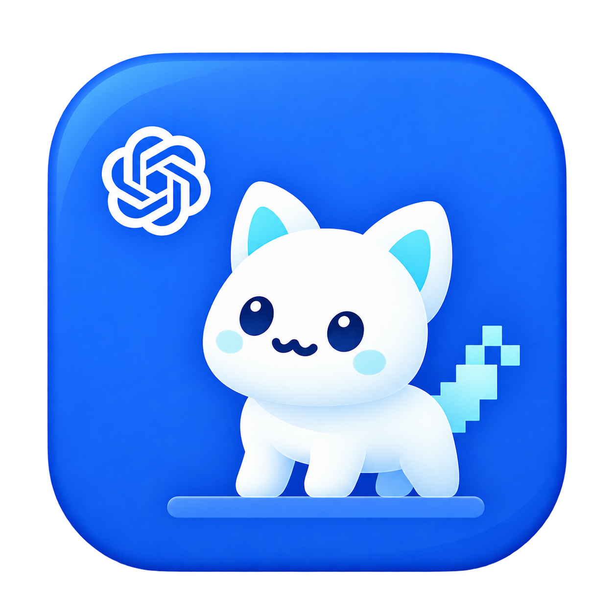

# Spine → Codex 桌宠转换器

<p align="center">
  
</p>

把 Spine 3.8 的 `.skel + .atlas + 贴图` 转换成可安装到 Codex 的自定义桌宠包。当前正式版本为 **v1.1.0**，支持 Windows 10/11。

## 下载正式版

普通用户不需要 Node.js，也不需要下载源码：

1. 打开 [Releases 最新版本](../../releases/latest)。
2. 下载 `SpineCodexConverter-Full-v1.1.0.zip`。
3. 完整解压 ZIP，双击 `SpineCodexConverter.exe`。
4. 选择 Spine 素材文件夹，先点击“检查动画”，再点击“开始转换”。

GitHub 自动生成的 `Source code.zip` 是开发源码，不是开箱即用的软件包。

## 准备 Spine 素材

输入目录至少需要一组同名的 Spine 3.8 导出文件：

```text
character.skel
character.atlas
character.png
```

如果 `.atlas` 引用了多张贴图，需要把所有贴图放在同一目录。当前转换器针对 **Spine 3.8**；其他 Spine 版本的二进制 `.skel` 不保证兼容。

### 可参考的素材来源

以下链接只用于寻找合法素材或测试数据，下载前必须阅读每个素材自己的许可证：

- [Spine 官方运行时与示例](https://esotericsoftware.com/spine-runtimes)：适合测试和学习；Spine Runtime 与示例受 Spine 自己的许可证约束。
- [itch.io 的 Spine 素材分类](https://itch.io/game-assets/tag-spine)：同时包含免费和付费素材，以每个作者页面标注的授权为准。
- [OpenGameArt 的 Spine 标签搜索](https://opengameart.org/art-search-advanced?field_art_tags_tid=spine)：不同条目的 CC0、CC BY、GPL 等许可并不相同，需要逐项核对。
- [Ark-Models（《明日方舟》模型节选）](https://github.com/isHarryh/Ark-Models)：非官方提取项目，仅建议用于个人本地研究；角色、模型和贴图权利不因下载而转移，不要打包进自己的公开 Release。

“可以下载”不等于“可以重新分发”。游戏角色、语音、立绘和动画通常仍属于游戏公司或原作者；本仓库不会附带这些素材。

## 转换与安装

转换完成后会生成：

```text
codex-pet-output/
├─ pet.json
├─ spritesheet.webp
├─ spritesheet-preview.png
├─ conversion-report.json
└─ resolved-config.json
```

真正安装时只需要 `pet.json` 和 `spritesheet.webp`。本工具当前输出 Codex 精灵格式 v1：1536 × 1872、8 列 × 9 行、每格 192 × 208，精灵表不超过 20 MiB。

### Windows 手动安装

在下面的目录中创建一个以桌宠 ID 命名的子文件夹：

```text
C:\Users\你的用户名\.codex\pets\桌宠ID\
├─ pet.json
└─ spritesheet.webp
```

不要写成 `C:\Uers`；Windows 的正确目录名是 `C:\Users`。也可以使用 PowerShell 自动定位当前用户目录：

```powershell
$petId = "my-pet"
$source = "D:\MyModel\codex-pet-output"
$target = Join-Path $env:USERPROFILE ".codex\pets\$petId"

New-Item -ItemType Directory -Path $target -Force
Copy-Item "$source\pet.json" "$target\pet.json" -Force
Copy-Item "$source\spritesheet.webp" "$target\spritesheet.webp" -Force
```

复制完成后，在桌面应用中打开 `Settings → Pets`，点击 `Refresh` 并选择新桌宠；需要显示浮动桌宠时输入 `/pet`。自定义桌宠保存在本机，不会自动同步到网页端。更多操作见 [完整使用说明](docs/USAGE.md) 和 [OpenAI Pets 文档](https://learn.chatgpt.com/docs/pets)。

## Codex 桌宠社区

以下均为非官方社区，与 OpenAI 没有隶属或背书关系：

- [Pets Codex](https://www.petscodex.com/)：桌宠浏览与安装社区。
- [senyo888/codex-pets](https://github.com/senyo888/codex-pets)：带预览、校验信息和安装说明的社区目录。
- [mileson/codex-pets](https://github.com/mileson/codex-pets)：可下载的 Codex Desktop 桌宠包合集。
- [GitHub `codex-pets` Topic](https://github.com/topics/codex-pets)：查找更多相关开源项目。

从社区下载时同样要核对素材许可、文件内容和校验值；不要默认社区上传者拥有角色版权。

## 功能

- 自动识别待机、移动、招手、跳跃、失败、等待和审视等动作。
- 缺少跳跃动画时可生成合成跳跃。
- 支持 25%～200% 的人物缩放和逐帧越界检查。
- 支持配置文件覆盖自动动画映射。
- 输出预览图、最终配置和完整转换报告。
- 完整版自带 Electron 渲染内核，不依赖系统浏览器或开发环境。

## 版本

| 版本 | 状态 | 说明 |
| --- | --- | --- |
| v1.1.0 | 当前正式版 | 完整桌面版、统一应用图标、仓库结构整理和完整安装说明 |
| v1.0.0 | 历史轻量版 | 依赖 Node.js 与系统浏览器，源码归档在 [`legacy/v1.0.0-lightweight`](legacy/v1.0.0-lightweight/) |

版本变化见 [CHANGELOG](CHANGELOG.md)，后续方向见 [ROADMAP](ROADMAP.md)。

## 从源码构建

```powershell
corepack pnpm install --frozen-lockfile
corepack pnpm build:desktop
corepack pnpm package:desktop
```

命令行转换：

```powershell
node scripts/convert-spine.mjs --input "D:\path\to\model-folder"
node scripts/convert-spine.mjs --input "D:\path\to\model-folder" --inspect
```

配置样例位于 [`examples/`](examples/)。维护者流程见 [发布说明](docs/RELEASING.md)，Markdown 插图方法见 [贡献与文档说明](docs/CONTRIBUTING.md)。

## 版权与许可

你只能转换、使用和分发自己拥有相应权利的素材。转换器生成新文件不会自动授予原角色、贴图、动画或语音的再分发权。

当前代码标记为 `UNLICENSED`，尚未授予公开复制、修改或再分发许可。本项目不是 OpenAI 官方产品；图标中的结形标识仅用于表达与 Codex 桌宠格式的兼容目标。
